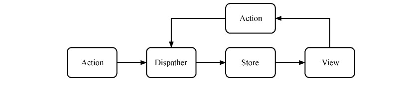
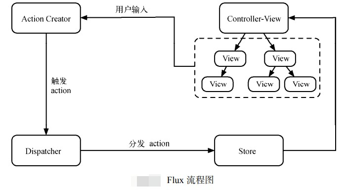

## 什么是Flux
> ### Flux是由一群Facebook工程师提出的，它的名字是拉丁语的Flow。Flux的提出主要是针对现有前端MVC框架的局限总结出来的一套基于dispatcher的前端应用架构模式。按照MVC的命名习惯，他应该叫ADSV（Action Dispatcher Store View）。
> ### Flux的核心思想就是数据和逻辑永远单向流动。

> ### 在Flux应用中，数据从action到dispatcher，再到store，最终到view的路线是单向不可逆的，各个角色之间不会像前端MVC模式那样存在交错的连线。

> ## Flux基本结构
> ### 一个Flux应用由三大部分组成dispatcher、store和view，其中dispatcher负责分发事件；store负责保存数据，同时响应事件并更新数据；view负责订阅store中的数据，并使用这些数据渲染相应的页面。
> ### 尽管它看起来和MVC架构有些像，但其中并没有一个职责明确的controller。事实上，Flux中存在一个controller-view的角色，但它的职责是将view和store进行绑定，并没有传统MVC中controller需要承担的复杂逻辑。

> ### Flux的事件会由若干个中央处理器来进行并发，这就是dispatcher。dispatcher是Flux中最核心的概念，也是flux这个npm包中的核心方法。
> ### 事实上，dispatcher的实现非常简单，我们需要关心的就是.register(callback)和dispatcher(action)这两个核心API即可。register方法用来注册一个监听器，而dispatch方法用来分发一个action。
> ## action
> action是一个普通的Javascript对象，一般包含type、payload等字段，用于描述一个事件以及需要改变的相关数据。比如点击页面上的某个按钮，可能会触发如下action：
```js
    {
        type:"click_button"
    }
```
> ### 这是flux中关于action对象一个最简单的实例。在开源社区中，有一套关于FLux中action对象该如何定义的规范，称为FSA(Flux Standard Action)。该规范定义了一个Flux Action必须拥有一个type字段，可以拥有error,payload或者meta字段。仅此而已。
> ## store
> ### 在Flux中，store负责保存数据，并定义修改数据的逻辑，同时调用dispatcher的register方法将自己注册称为一个监听器。这样每当我们使用dispatcher的dispatch方法分发一个action时，store注册的监听器就会被调用，同时得到这个action作为参数。
> ### store 一般会根据 action 的 type 字段来确定是否响应这个 action。若需要响应，则会根据 action中的信息修改 store 中的数据，并触发一个更新事件。
> ### 需要特别对外说明的是，在Flux中，store对外只暴露getter(读取器)而不是setter(设置器)。这意味着在store之外你只能读取store中的数据而不能进行任何修改。
> ## Controller-View
> ### 虽然说 Flux 的 3 大部分是 dispatcher、store 和 view，但是在这三者之间存在着一个简单却不可或缺的角色——controller-view。顾名思义，它既像 controller，又像 view，那么 controller-view究竟在 Flux 中发挥什么样的作用呢？
> ### 一般来说，controller-view 是整个应用最顶层的 view，这里不会涉及具体的业务逻辑，主要进行 store 与 React 组件（即 view 层）之间的绑定，定义数据更新及传递的方式。controller-view 会调用 store 暴露的 getter 获取存储其中的数据并设置为自己的 state，在render 时以 props 的形式传给自己的子组件（this.props.children）。介绍 store 时我们说过，当 store 响应某个 action 并更新数据后，会触发一个更新事件,这个更新事件就是在 controller-view 中进行监听的。当 store 更新时，controller-view 会重新获取 store 中的数据，然后调用 setState 方法触发界面重绘。这样所有的子组件就能获得更新后 store 中的数据了。
> ## View
> ### 在绝大多数的例子里，view 的角色都由 React 组件来扮演，但是 Flux 并没有限定 view 具体的实现方式。因此，其他的视图实现依然可以发挥 Flux 的强大能力，例如结合 Angular、Vue 等。在 Flux 中，view 除了显示界面，还有一条特殊的约定：如果界面操作需要修改数据，则必须使用 dispatcher 分发一个 action。事实上，除了这么做，没有其他方法可以在 Flux 中修改数据。
> ## actionCreator
>  ### 与 controller-view 一样，actionCreator 并不是 Flux 的核心概念，但在许多关于 Flux 的例子和文章中都会看到这个名词，因此有必要解释一下。actionCreator，顾名思义，就是用来创造 action的。为什么需要 actionCreator 呢？因为在很多时候我们在分发 action 的时候代码是冗余的。
> ### 考虑一个点赞的操作，如果用户给某条微博点了攒，可能会分发一个这样的action:
```javascript
    {
        type:'click_button',
        payload:{
            weiboId:123
        }
    }
```
> ### 实际上包含完整逻辑的代码更加复杂
```javascript
    //响应点赞的onclick方法
    handleClickUpdateVote(weiboId){
        appDispatcher.dispatch({
            type:'onclick_button',
            payload:{
                weiboId:weiboId
            }
        })
    }
```
> ### 事实上，在分发action的6行代码中，只有一行是变化的，其余的5行是固定不变的，这时我们可以创建一个actionCreator来帮助减少冗余的代码，同时方便重用逻辑:
```javascript
    //actions/AppAction.js
    import appDispatcher from '../dispatcher/appDispatcher';

    function upvote(weiboId){
        appDispatcher.dispatch({
            type:'click_upvote',
            payload:{
                weiboId:weiboId
            }
        });
    }

    //components/weibo.js
    import { upvote } from '../actions/AppAction';

    handleClickUpdateVote(weiboId){
        upvote(weiboId);
    }
```
> ### 可以看到，在view中，分发action变得异常简洁。同时当我们需要修改upvote的逻辑时，只需要在actionCreator中进行修改即可，所有调用upvote的view都无需变动。